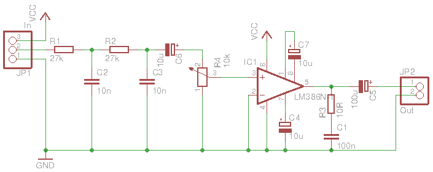

View this project on [CADLAB.io](https://cadlab.io/project/1281). 

# TTS

## Text-to-Speech for Arduino

- requires an amplifier on the PWM output pin (see below)
- see [blog articles](http://programmablehardware.blogspot.ie/search/label/tts)

## Supported Hardware

- ATmega328-based Arduinos (e.g., Uno, Pro, Pro Mini, etc.): pins 3, 9, 10
- [ArduTouch](https://github.com/maltman23/ArduTouch): pin 9
- ATmega1280-based Arduinos (e.g., Mega): pins 44, 45, 46
- Arduino Leonardo: pin 5
- Arduino Due: pins DAC0 or DAC1
- Teensy 3.2: pin A14
- Teensy 3.5, 3.6: pins A21, A22
- Teensy LC: pin A12
- ESP8266: pins 0 to 16 (with analogWrite())
- ESP32: DAC1 or DAC2 (pins 25 or 26)

## Amplifier

Component choices in this circuit aren't very critical:
- 22k (vs 27k) and 47n (vs 10n) parts in the input low-pass filter 
- 100n (vs 10u) bypass capacitor between pin 7 and gnd
- Used the inverting input instead of the non-inverting one (although in
  this circuit I noticed no difference)
- 47n (vs 100n) output snubber capacitor

## Credits
- original implementation by Clive Webster in [Webbotlib](http://webbot.org.uk/iPoint/30.page)
- ported to Arduino by [Gabriel Petrut](http://www.tehnorama.ro/minieric-modulul-de-control-si-sinteza-vocala/)
- Stephen Crane modified it to use pins other than pin 10 with the help of [this tutorial](https://sites.google.com/site/qeewiki/books/avr-guide/pwm-on-the-atmega328)
- [manitou48](https://github.com/manitou48) added support for Leonardo
and ARM processors with DAC (Teensy, Due)

## See Also
- Teensy [forum](https://forum.pjrc.com/threads/44587-TTS-(Text-to-Speech)-Library-Port)
- separate port/hack for MBED ARM with DAC [repository](https://developer.mbed.org/users/manitou/code/tts/)
- Hackaday article on [LM386 amplifiers](https://hackaday.com/2016/12/07/you-can-have-my-lm386s-when-you-pry-them-from-my-cold-dead-hands/)
